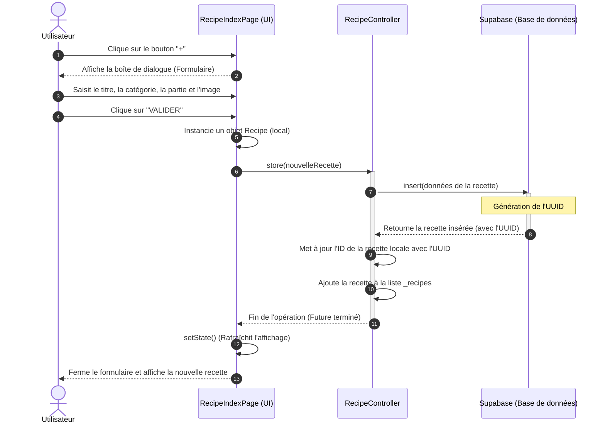

```mermaid
sequenceDiagram
    autonumber
    actor Lise as Utilisateur
    participant Vue as RecipeIndexPage (UI)
    participant Ctrl as RecipeController
    participant DB as Supabase (Base de données)

    Lise->>Vue: Clique sur le bouton "+"
    Vue-->>Lise: Affiche la boîte de dialogue (Formulaire)
    Lise->>Vue: Saisit le titre, la catégorie, la partie et l'image
    Lise->>Vue: Clique sur "VALIDER"
    
    Vue->>Vue: Instancie un objet Recipe (local)
    Vue->>Ctrl: store(nouvelleRecette)
    
    activate Ctrl
    Ctrl->>DB: insert(données de la recette)
    
    activate DB
    Note over DB: Génération de l'UUID
    DB-->>Ctrl: Retourne la recette insérée (avec l'UUID)
    deactivate DB
    
    Ctrl->>Ctrl: Met à jour l'ID de la recette locale avec l'UUID
    Ctrl->>Ctrl: Ajoute la recette à la liste _recipes
    Ctrl-->>Vue: Fin de l'opération (Future terminé)
    deactivate Ctrl
    
    Vue->>Vue: setState() (Rafraîchit l'affichage)
    Vue-->>Lise: Ferme le formulaire et affiche la nouvelle recette
```