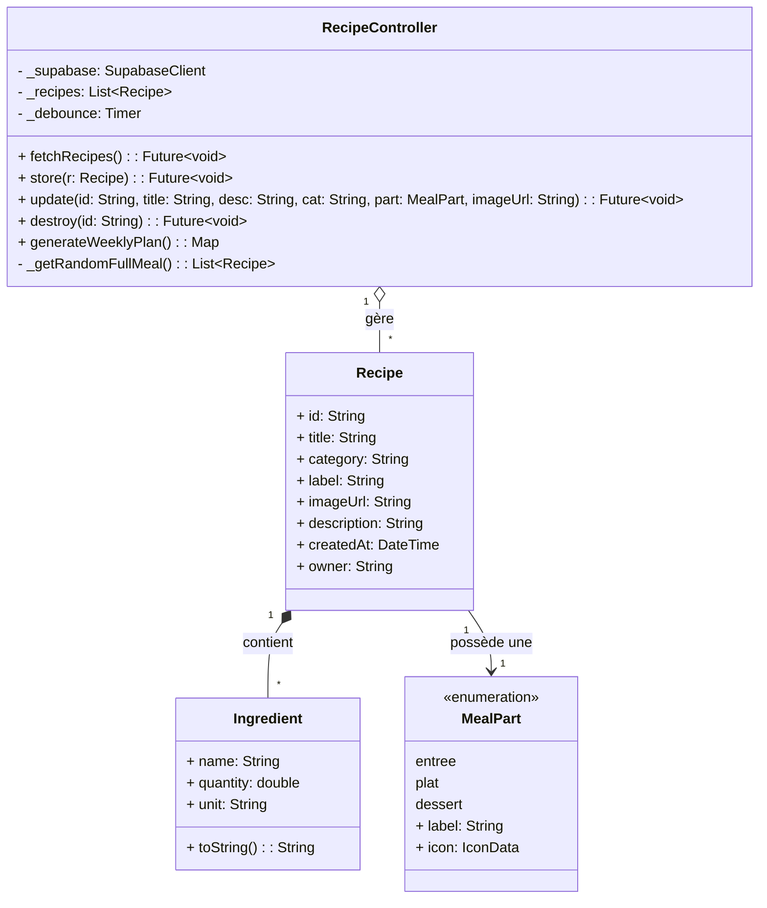

```mermaid
classDiagram
    class RecipeController {
        - _supabase: SupabaseClient
        - _recipes: List~Recipe~
        - _debounce: Timer
        + fetchRecipes(): Future~void~
        + store(r: Recipe): Future~void~
        + update(id: String, title: String, desc: String, cat: String, part: MealPart, imageUrl: String): Future~void~
        + destroy(id: String): Future~void~
        + generateWeeklyPlan(): Map
        - _getRandomFullMeal(): List~Recipe~
    }

    class Recipe {
        + id: String
        + title: String
        + category: String
        + label: String
        + imageUrl: String
        + description: String
        + createdAt: DateTime
        + owner: String
    }
    class Ingredient {
        + name: String
        + quantity: double
        + unit: String
        + toString(): String
    }

    class MealPart {
        <<enumeration>>
        entree
        plat
        dessert
        + label: String
        + icon: IconData
    }

    RecipeController "1" o-- "*" Recipe : gère
    Recipe "1" *-- "*" Ingredient : contient
    Recipe "1" --> "1" MealPart : possède une
```